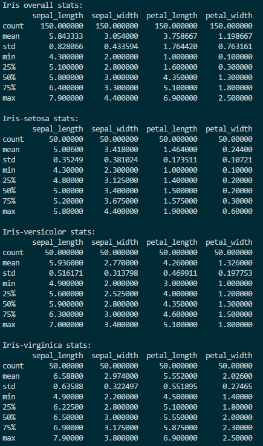
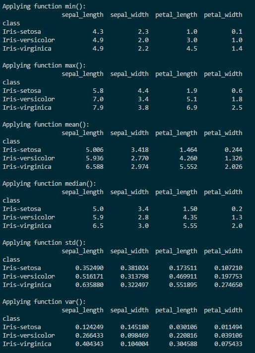
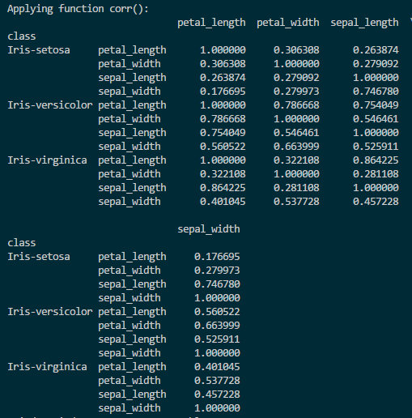
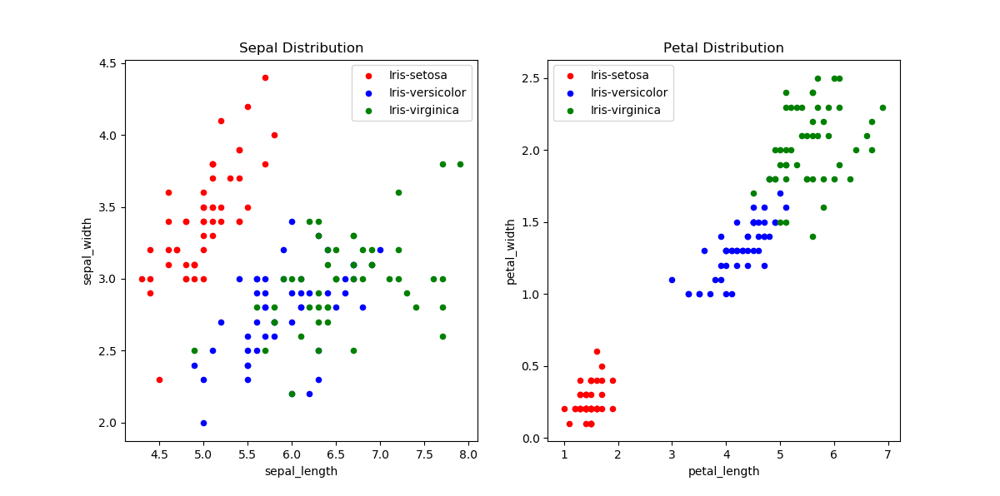
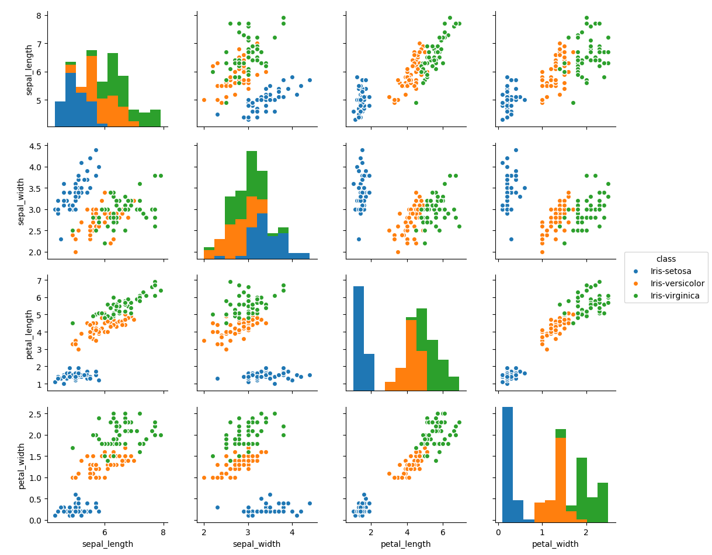
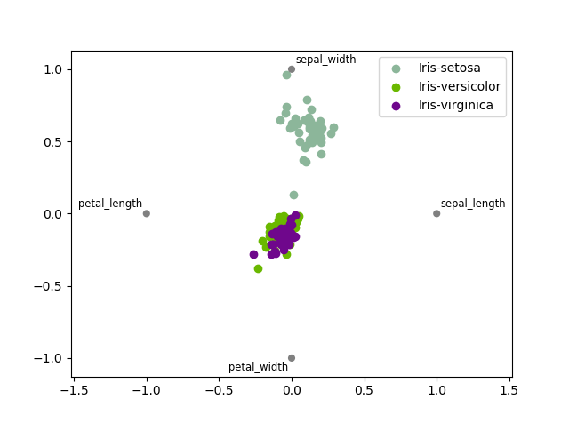

# Python Project on Iris Dataset

## Repository Content
File Name | Comment 
--------- | -------
Figure_1.png | Sepal/Petal distribution graph
Figure_2.png | Pairplot graph	
Figure_3.png | Radviz graph
Table_1.png | Screenshot of ```showBasicStats()``` function output
Table_2a.png | Screenshot of the first part of ```otherInterestingStats()``` function output
Table_2b.png | Screenshot of the second part of ```otherInterestingStats()``` function output
iris.csv | Iris dataset
irisProj.py | Python project script

## Summary
Fisher's Iris data set[[2](https://archive.ics.uci.edu/ml/datasets/iris)] is a multivariate data set introduced by the British statistician and biologist Ronald Fisher in his 1936 paper "The use of multiple measurements in taxonomic problems" as an example of linear discriminant analysis[[1](https://en.wikipedia.org/wiki/Iris_flower_data_set)].
The data set consists of 50 samples from each of three species of Iris (Iris setosa, Iris virginica and Iris versicolor) and reports on 4 characteristics of each of them: sepal length, sepal width, petal length, and petal width, in centimetres. 

It is often used in statistical science for illustrating various problems in statistics and machine learning for classification and prediction – to see which features of an iris can identify the flower as a certain type of iris.
Containing 150 observations, it is small but not trivial and the task it poses of discriminating between 3 species from measurements of their petals and sepals is simple yet challenging.

I demonstrate here basic statistical analysis of the Iris dataset in python, using pandas, seaborn and matplotlib packages.

## Analyses of the Iris data set
We can create many different views of the Iris dataset, both numerical (showing results in a table) and graphical.
By visualising numerical dataset we can much easier spot any trend or pattern appearing in the dataset.

From the following 3 screenshots, that show output of my script, it is not so obvious that there is a pattern there.
I've shown here, in a tabelar view, some of the most often calculations performed on the dataset:
*minimun, maximum, mean, median, standard deviation, unbiased variance, pairwise correlation of columns*:

 
 


On the other hand, when we see any of the following graphs generated by my script, it is quite obvious that the Iris-setosa species is separataed from the other two across all petal/sepal, width/length combinations:

 



We can also make the following statements regarding petal and sepal dimensions:

**1. Sepal length:**
  - Iris-virginica has the longest sepals
  - Iris-versicolor has the medium sepals length
  - Iris-setosa has the shortest sepals 
  
**2. Sepal width:**
  - Iris-setosa has the widest sepals
  - Iris-virginica has the medium width of sepals
  - Iris-versicolor has the narrowest sepals
  
**3. Petal length:**
  - Iris-virginica has the longest petals
  - Iris-versicolor has the medium petals length
  - Iris-setosa has the shortest petals

**4. Petal width:**
  - Iris-virginica has the widest petals
  - Iris-versicolor has the medium petals width
  -  Iris-setosa has the narrowest petals 
  
## Code documentation
To run the code, in a terminal type: ```python irishProj.py```

In the script, I first import dataset file and set some variables I use later in the code.

Then I define few functions:
-  ```showBasicStats()``` - prints some basic stats (minimum, maximum, mean, standard deviation, ...) using pandas'  **describe()** function
-  ```otherInterestingStats()``` - using pandas' **min(),max(),mean(),median(),std(),var(),corr()** functions in a loop on grouped dataframe
-  ```psDistributionPlot()``` - generates a picture with 2 graphs showing petal and sepal distribution (scatter plot)

In the main part of the script, I call above mentioned functions and also create *pairplot* and *radviz* graphs. 

## References
[1] https://en.wikipedia.org/wiki/Iris_flower_data_set

[2] https://archive.ics.uci.edu/ml/datasets/iris

[3] http://www.learn4master.com/machine-learning/visualize-iris-dataset-using-python

[4] https://machinelearningmastery.com/machine-learning-in-python-step-by-step/

[5] https://stats.stackexchange.com/questions/74776/what-aspects-of-the-iris-data-set-make-it-so-successful-as-an-example-teaching

[6] http://patrickhoey.com/downloads/Computer_Science/03_Patrick_Hoey_Data_Visualization_Dataset_paper.pdf

[7] http://pandas.pydata.org/

[8] https://seaborn.pydata.org

[9] https://matplotlib.org/
